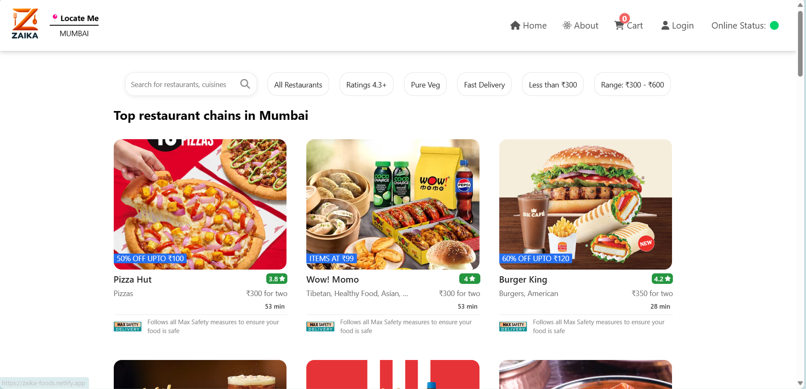

# Zaika - Food Delivery Platform 🚀

## Overview

Zaika is a dynamic food delivery website created with the Swiggy API. It provides users with a seamless and interactive experience for discovering and ordering food from various restaurants.

## Key Features

- **Location-wise Rendering:** Discover restaurants based on your location. Zaika intelligently adapts to your location or defaults to a specific city.

- **Rating 4.3+:** Explore highly-rated restaurants to ensure a delightful dining experience.

- **Pure Veg Options:** Catering to vegetarians with a diverse range of vegetarian menu choices.

- **Fast Delivery:** Find restaurants prioritizing swift and efficient delivery services.

- **Budget-Friendly Choices:**
  - Less than ₹300: Explore economical options.
  - ₹300 - ₹600 Range: Discover a variety of choices within this budget range.

- **Interactive Search:** Easily find restaurants by entering names or cuisine, with dynamic results.

- **Cart Functionality:** Save your favorite items for a hassle-free ordering experience.

- **Shimmer UI:** Enhance user experience with interactive loading animations.

- **Online Presence Check:** The application adapts to your online or offline status for a smooth experience.

## Behind the Scenes

- **Tech Stack:**
  - React: Dynamic user interface.
  - Redux: Smooth state management.
  - Vanilla CSS: Visually appealing and responsive design.
  - Jest: Testing for a bug-free experience.
  - React Parcel: Bundling, fast refresh, JSX support, and code splitting.
  - Custom Hooks: Enhancing reusability and maintaining clean, modular code.
  - React Router DOM: Smooth routing and navigation.

## Getting Started

### Prerequisites

- Node.js installed
- npm or yarn package manager

### Installation

1. Clone the repository.
2. Navigate to the project directory.
3. Run `npm install` to install dependencies.
4. Run `npm start` to start the development server.

## Live Project

Explore Zaika live: [Zaika Live](https://zaika-foods.netlify.app/)

## Contribution
Feel free to contribute to this project by opening issues or creating pull requests. Your feedback and contributions are highly appreciated!
